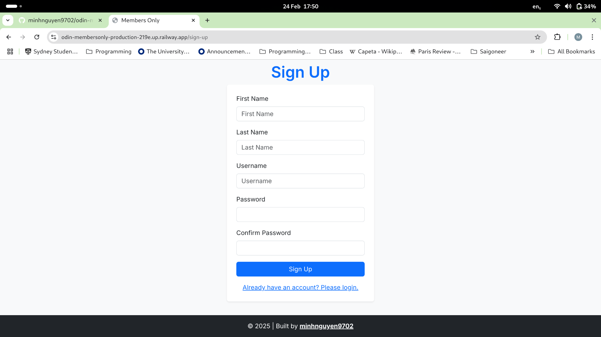

# Members Only
As part of the Odin Project's curriculum, I created a forum using Express, EJS and PSQL wherein users could create and view posts. However, only those with membership would be able to see the authors and timestamps of said posts. The purpose of this website was to put into practice what I had learned about Express and how to use it in conjunction with an SQL Database. Because this project uses EJS and not React, I used bootstrap instead of tailwind in order to style it. I had not yet reached the section of the curriculum in which API hosting was taught yet, therefore EJS had to be used instead of React for this app.

## Deploy
[Visit Members Only](https://odin-membersonly-production-219e.up.railway.app/)
## Screenshots

